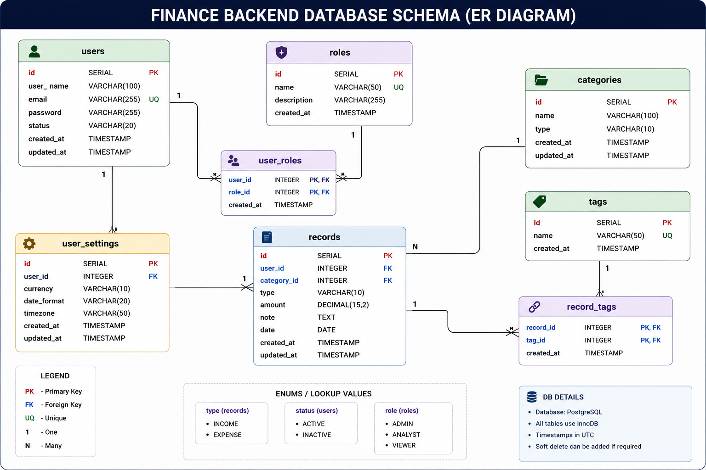

# 💰 Finance Backend API

A secure backend application built using Spring Boot with JWT authentication, role-based authorization, pagination, keyword search, Swagger API documentation, Docker support, and PostgreSQL integration.

---

# 🚀 Features

- JWT Authentication (Signup / Signin)
- BCrypt Password Encryption
- Role-Based Access Control (ADMIN, ANALYST, VIEWER)
- Financial Record Management APIs
- Pagination, Sorting, and Keyword Search
- Method-Level Security using `@PreAuthorize`
- Global Exception Handling
- Swagger API Documentation with JWT Authorization
- Dockerized Deployment Support
- GitHub Actions CI/CD Integration

---

# 🏗️ Spring Boot Backend Architecture


---

# 🔐 JWT Authentication Workflow


---

# 🔄 API Request & Security Flow


---

# 🗄️ Database Schema (ER Diagram)



---

# 🌐 Live API

## Base URL

```text
https://finance-backend-1r92.onrender.com
```

> ⚠️ Note:
> The application is hosted on Render free tier.  
> First request may take 2–3 minutes due to cold start.

---

# 📘 Swagger UI

```text
https://finance-backend-1r92.onrender.com/swagger-ui/index.html
```

Use Swagger UI to:
- Explore APIs
- Test endpoints
- Authorize JWT tokens
- Validate request/response flow

---

# 🔐 Authentication Flow

## 1️⃣ Signup

### Endpoint

```http
POST /auth/signup
```

### Request Body

```json
{
  "email": "user1@gmail.com",
  "password": "qwerty1234",
  "userName": "user1"
}
```

Default role assigned:

```text
VIEWER
```

---

## 2️⃣ Signin

### Endpoint

```http
POST /auth/signin
```

### Request Body

```json
{
  "email": "admin@finance.com",
  "password": "admin123"
}
```

### Response

```text
JWT_TOKEN
```

---

## 3️⃣ Use JWT Token

Protected endpoints require:

```http
Authorization: Bearer <JWT_TOKEN>
```

---

# 🔑 Default Admin Credentials

Admin user is automatically created during first startup.

```json
{
  "email": "admin@finance.com",
  "password": "admin123"
}
```

---

# 👥 Roles & Permissions

| Role | Access |
|---|---|
| ADMIN | Full Access |
| ANALYST | Read + Create |
| VIEWER | Read Only |

---

# 📁 Project Structure

```text
src/main/java/com/finance/backend/

├── config/
│   ├── SecurityConfig.java
│   ├── JwtFilter.java
│   ├── JwtService.java
│   ├── PasswordConfig.java
│   ├── OpenApiConfig.java
│   ├── DataInitializer.java
│
├── controller/
├── dto/
├── model/
├── repository/
├── service/
├── serviceImpl/
├── exception/
│
└── DemoApplication.java
```

---

# 🌐 API Endpoints

## 🔐 Authentication

```http
POST /auth/signup
POST /auth/signin
```

---

## 👤 Users

```http
GET    /users/{id}
GET    /users
PATCH  /users/{id}
PATCH  /users/{id}/role
PATCH  /users/{id}/status
DELETE /users/{id}
```

---

## 💰 Financial Records

```http
POST   /records
GET    /records
PUT    /records/{id}
DELETE /records/{id}
```

---

## 🔍 Search

```http
GET /records/search?keyword=food&page=0&size=5
```

Search supported on:
- category
- note

---

## 📊 Dashboard APIs

```http
GET /records/summary
GET /records/summary/category
GET /records/recent
```

---

# 📄 Pagination Example

```http
GET /records?page=0&size=5&type=INCOME
```

- `page` → page index (0-based)
- `size` → number of records per page
- Sorted by date descending

---

# ⚙️ Environment Variables

```env
SPRING_DATASOURCE_URL=jdbc:postgresql://<host>:5432/<db>
SPRING_DATASOURCE_USERNAME=<username>
SPRING_DATASOURCE_PASSWORD=<password>

ADMIN_EMAIL=admin@finance.com
ADMIN_PASSWORD=admin123
```

---

# 🐳 Docker Support

## Build Docker Image

```bash
docker build -t finance-backend .
```

## Run Container

```bash
docker run -p 8080:8080 finance-backend
```

---

# ▶️ Run Locally

```bash
mvn spring-boot:run
```

---

# ⚠️ Error Response Format

```json
{
  "message": "Invalid credentials",
  "status": 400,
  "timestamp": "2026-04-05T10:30:00"
}
```

---

# 🧪 Testing

Tested using:
- Postman
- Swagger UI

Validated:
- JWT Authentication
- Role-Based Authorization
- Pagination & Search
- Protected API Access

---

# 🔜 Future Improvements

- Refresh Token Support
- Advanced Filtering
- Unit & Integration Testing
- Rate Limiting
- Soft Delete Support

---

# 🛠️ Tech Stack

- Java
- Spring Boot
- Spring Security
- JWT
- PostgreSQL
- Swagger OpenAPI
- Docker
- Maven
- GitHub Actions
- Render
